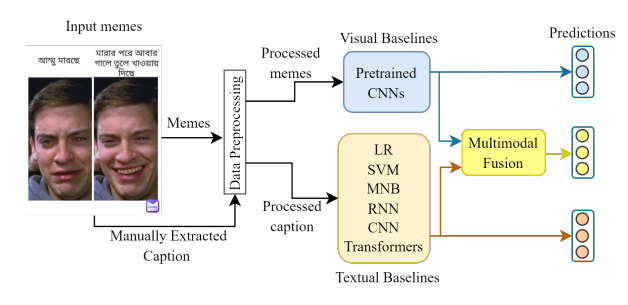

## MemoSen: A Multimodal Dataset for Sentiment Analysis of Memes

**Author:** Eftekhar Hossain, Omar Sharif, and Mohammed Moshiul Hoque

**Venue:** Language Resources and Evaluation Conference (LREC-2022)   

 [**Paper Link:**](http://www.lrec-conf.org/proceedings/lrec2022/pdf/2022.lrec-1.165.pdf)

 [**Dataset**](https://drive.google.com/file/d/12jxFuMz7jtE1kN9fi1ckspgHcKZhkT_B/view?usp=share_link)


## Contribution
- Created the MemoSen, a multimodal sentiment analysis dataset for Bengali consisting of 4368 memes annotated with Positive, Negative, and Neutral labels.
- Performed extensive experiments with state-of-the-art visual and textual models and synergistically integrated features of both modalities by utilizing different multimodal fusion approaches.


## System Overview
The figure presents the schematic diagram of our proposed system, which has three major phases: visual feature extractor, textual feature extractor, and multimodal fusion.





## Citation
If you use our dataset, models or code, please cite the following paper:
```
@inproceedings{hossain-etal-2022-memosen,
    title = "{M}emo{S}en: A Multimodal Dataset for Sentiment Analysis of Memes",
    author = "Hossain, Eftekhar  and
      Sharif, Omar  and
      Hoque, Mohammed Moshiul",
    booktitle = "Proceedings of the Thirteenth Language Resources and Evaluation Conference",
    month = jun,
    year = "2022",
    address = "Marseille, France",
    publisher = "European Language Resources Association",
    url = "https://aclanthology.org/2022.lrec-1.165",
    pages = "1542--1554",
    abstract = "Posting and sharing memes have become a powerful expedient of expressing opinions on social media in recent days. Analysis of sentiment from memes has gained much attention from researchers due to its substantial implications in various domains like finance and politics. Past studies on sentiment analysis of memes have primarily been conducted in English, where low-resource languages gain little or no attention. However, due to the proliferation of social media usage in recent years, sentiment analysis of memes is also a crucial research issue in low-resource languages. The scarcity of benchmark datasets is a significant barrier to performing multimodal sentiment analysis research in resource-constrained languages like Bengali. This paper presents a novel multimodal dataset (named MemoSen) for Bengali containing 4417 memes with three annotated labels positive, negative, and neutral. A detailed annotation guideline is provided to facilitate further resource development in this domain. Additionally, a set of experiments is carried out on MemoSen by constructing twelve unimodal (i.e., visual, textual) and ten multimodal (image+text) models. The evaluation exhibits that the integration of multimodal information significantly improves (about 1.2{\%}) the meme sentiment classification compared to the unimodal counterparts and thus elucidate the novel aspects of multimodality.",
}
```

